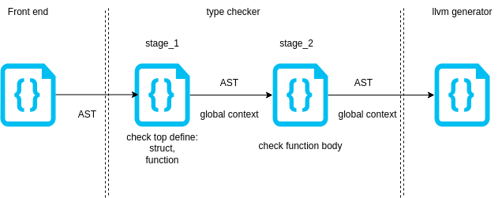

# Javalette Compiler
This project develops a toy language (JLC), that combines of C and Java.

The compiler consists two parts: the front end and the back end.

The front end is generated by [BNFC](https://bnfc.digitalgrammars.com/), using the syntax configuration file [javalette.cf](./src/Javalette.cf) under src.

And the back end also generally consists two parts : Type checker and llvm generator. 

Additionally, for easy debugging of syntax configuration, a simple web interface is provide to show the parsed AST is provided. You can find it at [ast_viewer](./ast_viewer/)

# How to run this project
## Clone 
```shell 
git clone xxx

# pull submodule which includes the testsuit
git submodule update --init 
```


## Env
1. Compiling this project doesn't require any additional dependeces. 
2. However running it with LLVM requires llvm package to be installed. (>=16.0.0).
3. And if you want to regenerate the parser, which means you want to modify the syntax configuration, you need to install BNFC package. 

## Regenerate 
```shell 
make gen
```
The code under [parser part](./src/parser/) will be regenerated.   

## JLC
```shell
make jlc
```
jlc, is the compiler we use to compile xxx.jl


## Test-ut
```shell
make test
```
It compiles all the `test_xxx.cpp` files under [test](./src/test/).

## Help script
scripts under [scripts](./scripts/) are for running and debugging.

### compile and run a xx.jl file
```bash
make jlc -j12

bash scripts/build_and_run.sh test_code/temp_op.jl
```
you will get
```shell 
OK
Running the generated llvm ir code:
-----------------------------------
Hello World
-----------------------------------
```

# JLC:javelette

# Compiler design 


## Typer Checker
In this stage, type checking is seperated into several detail stages. The code is located under src/typechecker.

Generally, it includes stage:  
1. user defined type declearation [jlc_tc_udt_dcl.cpp](./src/typechecker/jlc_tc_udt_dcl.cpp)
2. user defined type definition [jlc_tc_udt_def.cpp](./src/typechecker/jlc_tc_func_def.cpp)
3. function declearation [jlc_tc_func_dcl.cpp](./src/typechecker/jlc_tc_func_dcl.h)
4. function definition [jlc_tc_func_def.cpp](./src/typechecker/jlc_tc_func_def.cpp)

## LLVM generator
Instead of using LLVM development framework directly, we implemented a set of APIs [llvm.cpp](./src/llvm/llvm.cpp) to generate LLVM code ourselves.

More specific design details will be discussed in the following documents.

[Control flow](./doc/control_flow.md)  
[Array](./doc/array.md)  
[Enum](./doc/enum.md)  
[Struct](./doc/struct.md)  
[Class](./doc/class.md)  
[Runtime polymorphically](./doc/polymorphically.md)  


# JLC language feature.

## Base inner type:
+ INT
+ DOUBLE
+ BOOLEAN
+ STRING (cannot be defined as a variable now).

```c
int main(){

    int a = 1;
    double b = 1.0;
    boolean c = false;

    printInt(a);
    printDouble(b);
    if(c==false){
        printString("c is false");
    }
    return 0;
}
```

## Control flow
```c
int main(){

    if(true){
        printString("if-block");
    }

    if(false){

    }else{
        printString("if-else block");
    }

    int i = 0;
    while (i<5){
        i++;
    }

    return 0;
}

```

## Enum

```c

enum Color {
  RED,
  GREEN,
  BLUE
};

int main(){
    Color color = Color.RED;
    if(color == Color.RED){
        printString("color is RED");
    }

    return 0;
}

```
## Struct 

```c

typedef struct A_t * A;
  struct A_t{
     int a;
  };
  
  // or 
  typedef struct B_t* B;
  
  struct B_t {
      int b;
  };
  
  int main(){
  
      // define a struct variable 
      A a = new A_t;
  
      // access memeber 
      a->a = 1;

      printInt(a->a);
  
      return 0;
  }
```


## Class

```c
class A {
  int val;

  void incr () {val++; return;}

  int value () {return val;}
}


int main(){
    A a = new A;
    a.incr();
    printInt(a.val);
    return 0;
}

```

## Base type array
```c
int main(){
    int[] a = new int[3];
    a[0] = 1;
    a[1] = 2;
    a[2] = 3;

    printInt(a.length);

    for(int e: a){
        printInt(e);
    }

    int[][] b = new int[2][2];
    
    return 0;
}
```
## Enum, Struct, Class array
```c
enum Color {
  RED,
  GREEN,
  BLUE
};

typedef struct A_t * A;
  struct A_t{
     int a;
  };

class B {
  int val;

  void incr () {val++; return;}

  int value () {return val;}
}


int main(){
    Color[] c = new Color[10];
    
    # A[n] is not initialized
    # need user to initialize it
    A[] a = new A[10];
    
    a[0] = new A_t;

    
    B[] b = new B[10];
    b[0] = new B;
    
    return 0;
}
```

## Runtime polymorphism
```c
class A {
    void f(){
        printString("I am A");
    }
}

class B extends A {
    void f(){
        printString("I am B");
    }
}

class C extends B {
    void f(){
        printString("I am C");
    }
}

int main(){
    A a = new A;
    A b = new B;
    A c = new C;

    a.f();
    b.f();
    c.f();

    return 0;
}
```


## operator

|op|example|comment|
|-|-|-|
|+|a=a+b;| 
|-|a=a-b; a= -b; -b;|
|++| a++;|
|--| a--;|
|x|a=a*b;|
|/|a=a/b;|
|%|a=a%b;|
|!|!true==false;|
|==| a==b|
|!=| a!=b|
|>| a>b|
|>=| a>=b|
|<| a<b|
|<=| a<=b|
|()|(int)0.0|
|->| a->a| only for struct|
|[]| a[0]|
|.| a.a| for enum,class|
|new| new A;|